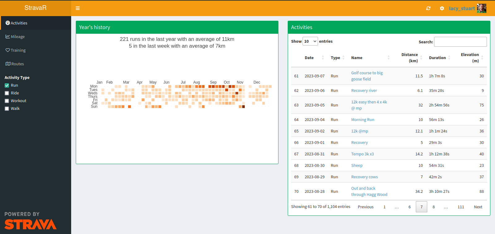
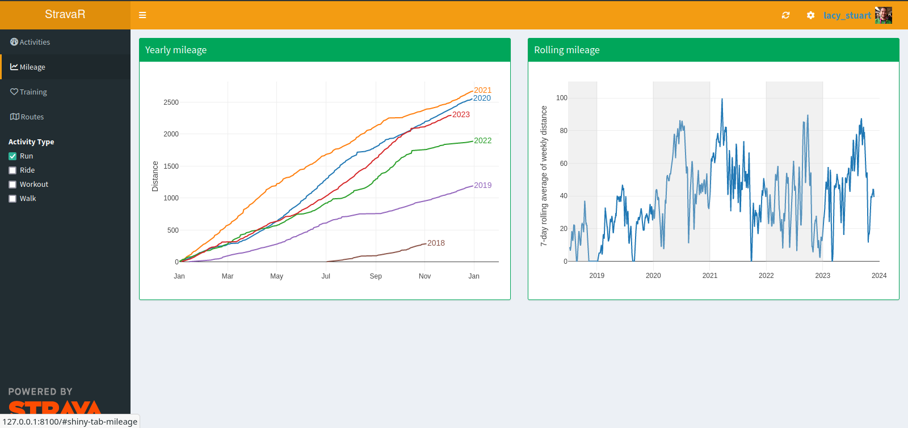
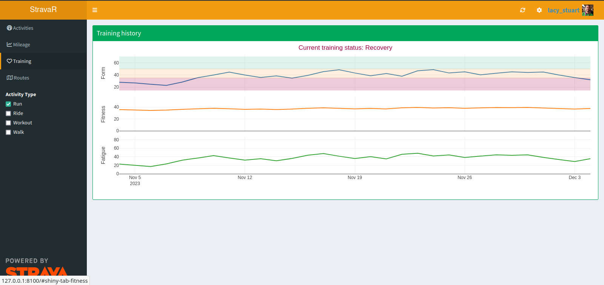
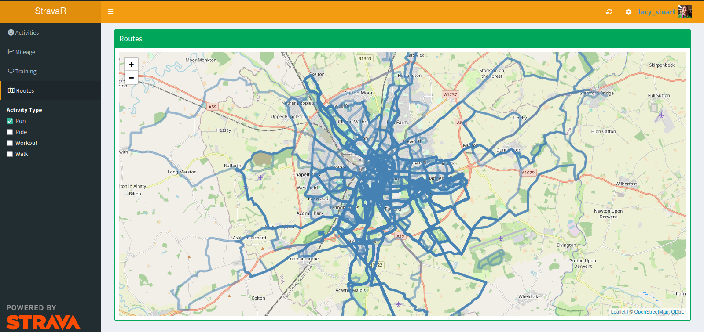

## StravaR

StravaR is a Shiny app allowing you to explore your fitness data within R with all the flexibility you need!



It maintains a local database of all your activities so you not only get full ownership of your data in an easy to use format, but you can analyze it to your heart's content outside of the Shiny app.

### Features

I've written the app to provide the numbers & plots that I most want to see from my running data and that I can't find easily on the Strava website.
You'll likely have different use-cases so feel free to modify this code - I'd be interested to see what interesting visualisations people make with their fitness data!

**NB: the app works with any type of activity (running, cycling, walking, etc...), I just talk about running as it's my main sport.**
In all of the tabs shown below, you can select which sports to be shown from the checkboxes on the left.
Your default sport can be changed through the settings cog in the top right.

I like to compare my year's cumulative distance with previous years so I know if I'm roughly running at my usual amount, although my number 1 training target is my weekly mileage so I also plot this (as a rolling average to smooth it out).



While I don't use it a huge amount, I like being aware of my heart-rate stress score based training levels, as I do tend to find that the Optimal phase tends to correlate with my peak training weeks.



Finally, when I haven't got a specific race planned, my main motivation comes from exploring new places so I want to be able to quickly explore all my running routes on an interactive map.



### Installation

1.  Clone this repository to your computer (within RStudio, File -\> New Project -\> Version Control -\> Git, then enter `https://github.com/stulacy/fit-viz.git` as the Repository URL)
2.  Install any missing packages that are loaded in `server.R`. RStudio should highlight these.
3.  Download an archive of all your Strava data, which is found in the (deliberately?) confusingly named page [Delete Your Account (NB: this link WILL NOT delete your account!)](https://www.strava.com/athlete/delete_your_account). If you don't want to click that scary link, in a web browser click your Profile Pic in the top right, Settings, My Account, scroll down to Download or Delete Your Account and click Get Started. Your archive will be emailed to you shortly
4.  Open either of `server.R`, `ui.R`, or `app.R` in RStudio and click the down arrow next to Run App button in the top right of the editor and select 'Run External'
5.  Now Run App and it should redirect you to it open in a web browser where you will be prompted to enter some details about yourself and upload the archive you downloaded in Step 3. This can take a while, it takes just under an hour to upload 1,100 activities on my laptop.

### Setup API access to Strava

Once you've uploaded your first data archive, you can upload more activities in the future by repeating the export process and uploading the archive through clicking the Refresh button in the top right.
However, this is a tedious manual process, particularly if we only want to upload 4 activities from the last week.

If you don't mind a bit of setup, you can get your data instantly synced with your Strava account through their API.
You'll need to create an App through [Strava's developer scheme](https://www.strava.com/settings/api) and substitute the Client ID and Secret in the line `STRAVA_APP <- oauth_app(...)` in `server.R` as the `key` and `secret` arguments respectively.
Then you are good to go by clicking the Connect With Strava button in the top right!

**Why can't I just use your key and secret?**
Because the `oauth 2.0` authentication method used by the Strava API isn't ideal for Desktop Apps (as in those that get installed to each users' computer, rather than running a single instance in the Cloud), as there's no way of installing the app without making the key and secret accessible to the user.
These values are considered sensitive because anyone could use them to make you think you were authorising your Strava account to connect to my app, but in reality they get access to your data.
I didn't want to write a Cloud based app as I'd rather everyone be able to own and manage their own data, rather than hand it off to yet another third party!

If you have any questions or problems, please create an Issue in this repo.

### Database

The app creates a [duckdb](https://duckdb.org/) database to store your data, which is an embedded database designed for analytics (i.e. it is column-based compared to SQLite's row-based), this saved in the working directory as `data.db`.
It supports querying through standard SQL commands, see the [documentation](https://duckdb.org/docs/api/r.html), although it is much easier to interface to it using the fantastic [dbplyr package](https://dbplyr.tidyverse.org/) which allows you to use standard `tidyverse` functions instead.

For example, to load all your activities you would do the following:

```r
library(tidyverse)
library(duckdb)

# Connect to the database
con <- dbConnect(duckdb(), "data.db")

tbl(con, "activities") |>
    collect()  # This command reads the data from the DB into memory
```

```
# A tibble: 1,171 × 7
   activity_id activity_type name                                            start_time          distance duration elevation
         <dbl> <chr>         <chr>                                           <dttm>                 <dbl>    <dbl>     <dbl>
 1  9329577757 Run           "Stretching legs"                               2023-06-25 06:43:26     7.5      2534      18.3
 2  9337323631 Run           "Cow cow cow"                                   2023-06-26 11:22:44     8.01     2667      42.9
 3  9342310857 Run           "Bish"                                          2023-06-27 06:58:44     8        2605      20.2
 4  9355605801 Run           "Acaster Malbis river"                          2023-06-29 09:12:45    16        5516      17.0
 5  9361568591 Run           "Recovery"                                      2023-06-30 10:19:55     5.01     1830      29.7
 6  9370223236 Run           "Chill evening run"                             2023-07-01 18:21:45     8.01     2615      15.5
 7  9378957042 Run           "Askham Richard - Bilbrough - Cop - Bog - Bish" 2023-07-03 06:06:38    23        8126     102. 
 8  9385907307 Run           "Cows"                                          2023-07-04 11:12:57     6.3      2094      20.8
 9  9392630511 Run           "Golf course \"\"10\"\""                        2023-07-05 11:08:25    11.5      3790      29.3
10  9399049616 Run           "Threshold run 5x1km"                           2023-07-06 11:41:49    10.0      3119      16.8
# ℹ 1,161 more rows
# ℹ Use `print(n = ...)` to see more rows
```

You can use standard `tidyverse` functions on the database connection before you load it into R with `collect`, i.e. if I want to find all my long runs from Summer 2020 I could do the following:

```r
tbl(con, "activities") |>
    filter(
      start_time >= '2020-05-01', 
      start_time < '2020-09-01',
      distance > 20,
      activity_type == 'Run'
    ) |>
    arrange(desc(distance)) |>
    collect() 
```

```
# A tibble: 12 × 7
   activity_id activity_type name                      start_time          distance duration elevation
         <dbl> <chr>         <chr>                     <dttm>                 <dbl>    <dbl>     <dbl>
 1  3887193271 Run           Lockdown marathon 3:51:42 2020-08-09 07:16:46     42.3    13945     152. 
 2  3786050932 Run           Too hot!                  2020-07-19 11:08:24     34      12905      79.0
 3  3578083277 Run           Lunch Run                 2020-06-07 10:50:03     32.2    12970     101. 
 4  3648703947 Run           Morning Run               2020-06-21 09:41:21     32.2    12080      92.2
 5  3717455954 Run           Lunch Run                 2020-07-05 10:51:51     32.2    11588      83.9
 6  3751088445 Run           Lunch Run                 2020-07-12 10:38:14     27.5     9485      78.2
 7  3542179455 Run           Lunch Run                 2020-05-31 11:27:01     27.5     9934      67.5
 8  3683255248 Run           Lunch Run                 2020-06-28 10:15:23     24.2     7936      71.9
 9  3467388733 Run           Afternoon Run             2020-05-17 13:48:47     24.1     8420      47.5
10  3613589532 Run           Half marathon pb 1:42:31  2020-06-14 11:39:48     21.1     6164      51.8
11  3820814279 Run           Half marathon pb 1:39:53  2020-07-26 11:11:18     21.1     6074      51.4
12  3430728862 Run           Afternoon Run             2020-05-10 13:59:18     21       7568      61.9
```

**NB: When you are finished with the database, close the connection and shut it down!**

```r
dbDisconnect(con, shutdown=TRUE)
```